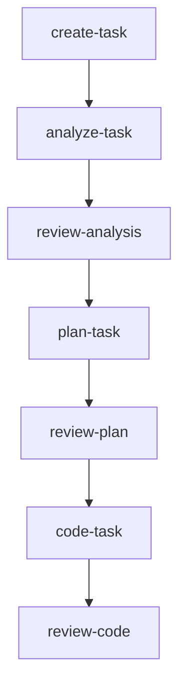
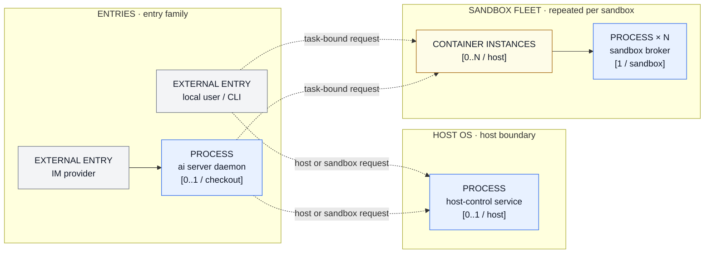
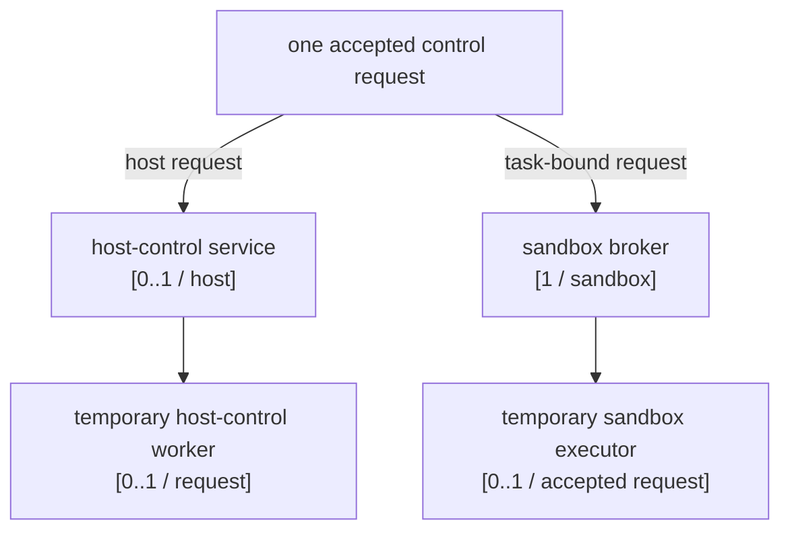
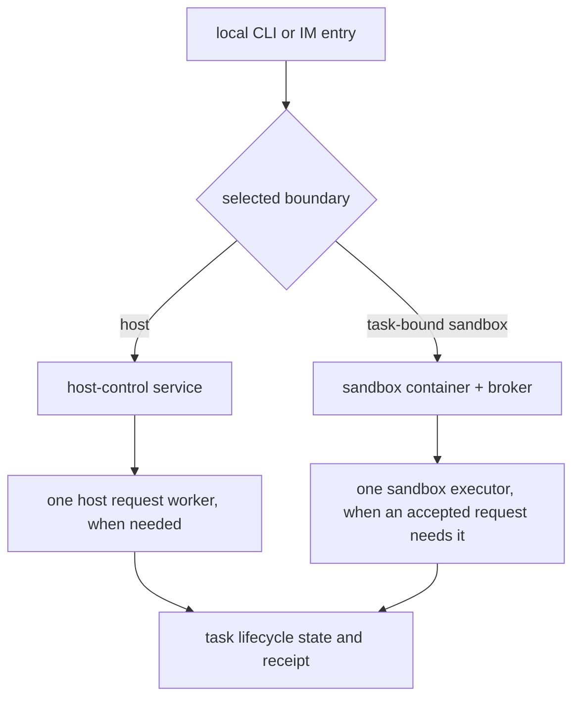

# Architecture Overview

[← Back to README](../../README.md) · [中文](../zh-CN/architecture.md)

agent-infra is intentionally simple: a bootstrap CLI creates the seed configuration, then AI skills and workflows take over.

## End-to-End Flow

1. **Install** — `npm install -g @fitlab-ai/agent-infra` (or `brew install fitlab-ai/tap/agent-infra` on macOS, or use the shell script wrapper)
2. **Initialize** — `ai init` in the project root to generate `.agents/.airc.json` and install the seed command
3. **Render** — run `update-agent-infra` in any AI TUI to detect the bundled template version and generate managed files
4. **Develop** — use the user-facing skill sequence below. Internal workflow labels are not skill entry points.
5. **Update** — run `update-agent-infra` again whenever a new template version is available



Delivery after `review-code` is conditional: the workflow may enter `commit`, `create-pr`, `watch-pr`, or `complete-task` according to the reviewed tree, PR state, and checks.

## Layered Architecture

```text
┌───────────────────────────────────────────────────────┐
│                     AI TUI Layer                      │
│  Claude Code · Codex · Antigravity · OpenCode         │
└──────────────────────────┬────────────────────────────┘
                           │ slash commands
                           ▼
┌───────────────────────────────────────────────────────┐
│                     Shared Layer                      │
│         Skills  ·  Workflows  ·  Templates            │
└──────────────────────────┬────────────────────────────┘
                           │ renders into
                           ▼
┌───────────────────────────────────────────────────────┐
│                    Project Layer                      │
│               .agents/  ·  AGENTS.md                  │
└───────────────────────────────────────────────────────┘
```

## Runtime and Control-Plane Map

The runtime views are intentionally split. The first view answers only: which entry points and core long-lived components exist, where they live, and how many instances may exist. The second view explains only the short-lived processes derived by one accepted request.

### 1. Highest-level core topology



This is the primary architecture picture:

- `local user / CLI` and `IM provider` are the two entry families.
- `ai server daemon` is an optional IM entry process: at most one per checkout. A local CLI does not require it.
- `host-control service` is one host-level service: `[0..1 / host]`.
- `CONTAINER INSTANCES` means one Docker container per sandbox, `[0..N / host]`. It is a sandbox boundary and count, not another project process.
- Every sandbox has one `sandbox broker`, `[1 / sandbox]`. The broker is the sandbox's long-lived control process.
- Dashed arrows show which control route an entry may select. They are not a fixed parent-child process chain. The transient dispatch implementation is intentionally hidden here.

The container engine and OS service manager own infrastructure around this picture, but they are not one process per sandbox and are not included in the core process count. User-created programs inside a sandbox are also outside this architecture view.

| Core item | Multiplicity | Meaning |
| --- | --- | --- |
| Local CLI entry | `0..N / invocation` | A user-facing entry; it may select a host or task-bound sandbox route. |
| IM provider entry | `0..N / provider` | An external message source. |
| `ai server daemon` | `0..1 / checkout` | The optional process that admits IM traffic for one checkout. |
| `host-control service` | `0..1 / host` | The host-side control service and direct-host authority. |
| Docker sandbox container | `0..N / host` | One isolated container instance per sandbox. |
| `sandbox broker` | `1 / sandbox` | One control broker inside each sandbox container. |

### 2. One-request derived processes



The `sandbox executor` is not another sandbox and not another broker. It is a short-lived project-controlled worker created only after a broker accepts one authorized control request; it performs that request and then exits. With no accepted request, there is no executor. The host-control worker has the same relationship to one host-side request.

This lower view does not enumerate the programs a user starts inside the container. Those programs are variable, user-owned, and outside the project's fixed process topology.

### Entry and request boundaries

- A local CLI is a direct entry family. It can select host control or a task-bound sandbox without requiring the IM daemon.
- An IM message enters through the optional `ai server daemon`, which admits the request and selects the same host or sandbox control boundary.
- Host control and the sandbox broker are separate control boundaries. Host control owns host-side authorization and workers; the broker owns sandbox-side authorization and the executor for one accepted request.
- The task lifecycle logic that validates task files and transitions is in-process domain logic, not a process and not part of the highest-level process count.

## Core Component Matrix

| Component | Start / stop | Communication | Boundary and count | Durable facts | Failure boundary |
| --- | --- | --- | --- | --- | --- |
| Local CLI entry | Started by a user invocation; ends with that invocation | Local process arguments and standard streams | Host user entry; `0..N / invocation` | Command result and any task receipt | The command result does not prove that a remote or sandbox operation completed. |
| IM provider entry | External provider delivers messages; the provider owns its connection lifecycle | Provider API or long-lived adapter connection | External identity; not an OS process in this repository | Provider message and reply evidence | Provider, credential, and connection failures remain outside local task authority. |
| `ai server` daemon | `ai server start` starts at most one daemon per checkout; signals stop it | Provider adapter and admitted request dispatch | Host user process; `0..1 / checkout` | Checkout-scoped PID identity and daemon logs | Stale identity or adapter failure must not be confused with task success. |
| `host-control` service | OS user service manager starts/stops one service per host | Private host endpoint and request/response records | Host user boundary; `0..1 / host` | Endpoint, token, audit, and worker records | Missing authority fails closed; accepted work is not silently replayed after an uncertain result. |
| Docker sandbox container | Container engine creates/stops one container per sandbox | Container runtime and mounted task projection | Sandbox boundary; `0..N / host` | Container identity, generation, and sandbox control records | Container availability alone does not prove host-control or task-lifecycle readiness. |
| Sandbox broker | Starts with its sandbox control state and stops with that sandbox | Sandbox control channel and request records | One broker inside each sandbox; `[1 / sandbox]` | Manifest, lease, owner, generation, and execution audit | Stale identity, lease, or admission failure is rejected before execution. |

## Control and Lifecycle Views

These views describe requests and state, not additional processes. They are deliberately below the core topology.



`task.md`, lifecycle journals, artifacts, receipts, and platform records are facts owned by their respective lifecycle operations. They are not processes and are not counted in the highest-level topology.

| Operation | Selected boundary | Authoritative result | Recovery rule |
| --- | --- | --- | --- |
| Create | Host-control path | `task.md`, task directory, short ID, and create receipt | Reconcile partial writes before retrying. |
| Task event or artifact | Host-control or sandbox broker path | Event/artifact provenance and task state | Preserve the receipt; do not guess after an accepted unknown result. |
| Restore | Lifecycle request boundary | Task directory, journal, registry, and final state | Reconcile journal and final directory before retrying. |
| Block or cancel | Authorized lifecycle boundary | Status, reason, journal, and released resources | Stop at the first unknown side effect. |
| Complete | Lifecycle and artifact gates | Completed state, receipts, review, and platform evidence | Missing evidence keeps completion closed. |

## Platform Boundary

| Execution context | Core capability | Important limitation |
| --- | --- | --- |
| macOS | `host-control` can be managed by a user-scoped launchd service; configured container engines may provide sandboxes | Container capability does not replace the host service or task-bound lifecycle. |
| Linux | `host-control` can be managed by a user-scoped systemd service; configured container engines may provide sandboxes | The engine, broker, host-control, and task lifecycle remain separate boundaries. |
| Native Windows | Some CLI/process and Docker Desktop container paths may exist | No equivalent native host-control service closes the complete host task-bound lifecycle. |
| WSL2 Linux | Linux-side service and container behavior depends on the distribution and runtime configuration | WSL2 Linux behavior is not native Windows host-control support. |

## Scope and Source Pointers

This document describes the repository's fixed control-plane components and their boundaries. It intentionally does not enumerate user-created programs inside a sandbox or every short-lived implementation detail used to dispatch a command.

Detailed provider, sandbox, and platform contracts remain in [Feishu Bridge](./feishu-bridge.md), [Sandbox](./sandbox.md), and [Platform Support](./platform-support.md). This overview keeps the entry families, host-control count, sandbox count, broker count, and request-derived control processes understandable in one place.

It does not add a Windows host-control implementation, a new adapter, a compatibility shim, a migration, or a runtime state-machine change.
