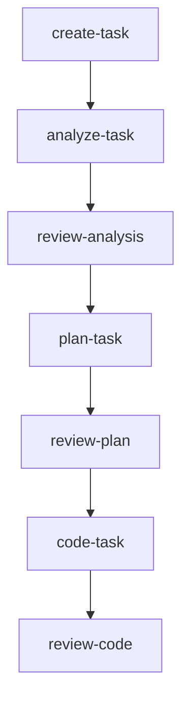
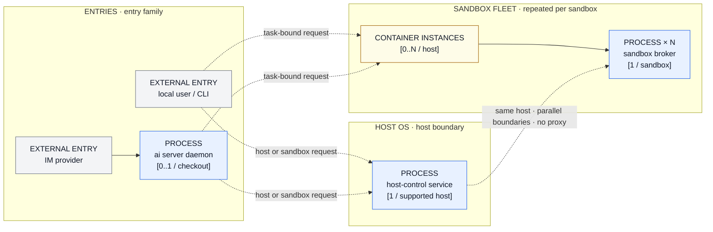
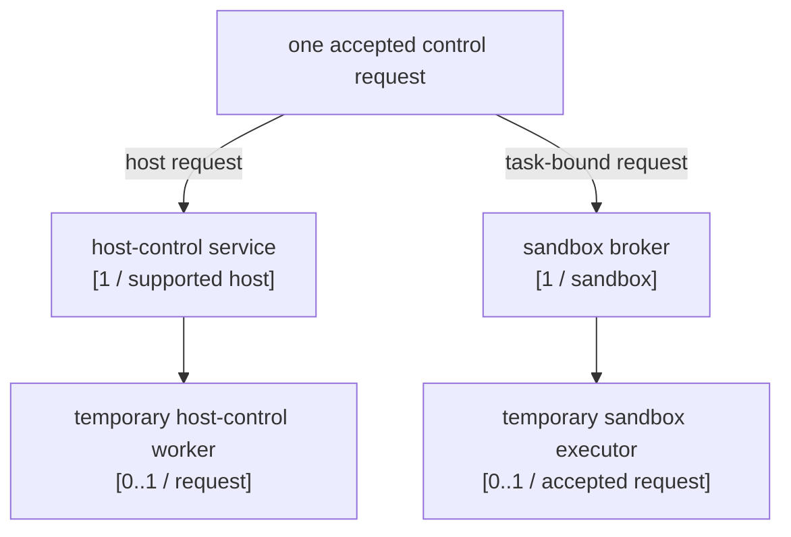
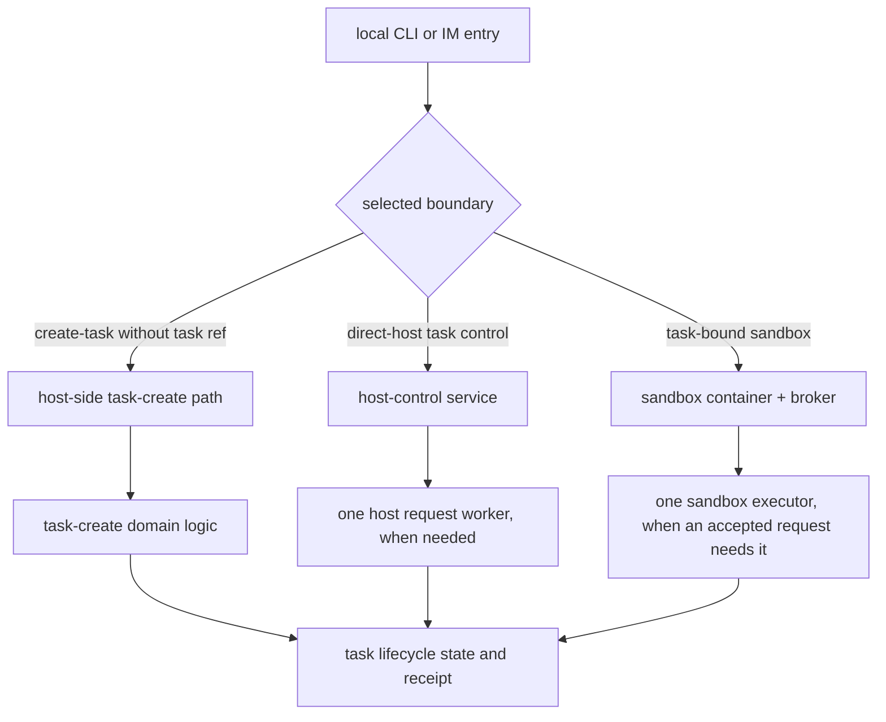

# Architecture Overview

[← Back to README](../../README.md) · [中文](../zh-CN/architecture.md)

agent-infra is intentionally simple: a bootstrap CLI creates the seed configuration, then AI skills and workflows take over.

## End-to-End Flow

1. **Install** — `npm install -g @fitlab-ai/agent-infra` (or `brew install fitlab-ai/tap/agent-infra` on macOS, or use the shell script wrapper)
2. **Initialize** — `ai init` in the project root to generate `.agents/.airc.json` and install the seed command
3. **Render** — run `update-agent-infra` in any AI TUI to detect the bundled template version and generate managed files
4. **Develop** — use the user-facing skill sequence below. Internal workflow labels are not skill entry points.
5. **Update** — run `update-agent-infra` again whenever a new template version is available



Delivery after `review-code` is conditional: the workflow may enter `commit`, `create-pr`, `watch-pr`, or `complete-task` according to the reviewed tree, PR state, and checks.

## Layered Architecture

```text
┌───────────────────────────────────────────────────────┐
│                     AI TUI Layer                      │
│  Claude Code · Codex · Antigravity · OpenCode         │
└──────────────────────────┬────────────────────────────┘
                           │ slash commands
                           ▼
┌───────────────────────────────────────────────────────┐
│                     Shared Layer                      │
│         Skills  ·  Workflows  ·  Templates            │
└──────────────────────────┬────────────────────────────┘
                           │ renders into
                           ▼
┌───────────────────────────────────────────────────────┐
│                    Project Layer                      │
│               .agents/  ·  AGENTS.md                  │
└───────────────────────────────────────────────────────┘
```

## Runtime and Control-Plane Map

The runtime views are intentionally split. The first view answers only: which entry points and core long-lived components exist, where they live, and how many instances may exist. The second view explains only the short-lived processes derived by one accepted request.

Cardinality notation in the views below has three meanings:

- `1 / supported host` or `1 / sandbox` is required for each existing supported boundary. `0` is not a valid steady-state count for that boundary; absence means the boundary is unavailable or not ready, and its control requests fail closed.
- `0..1` is an optional singleton, such as the IM daemon or a worker created only when a request needs it.
- `0..N` is a population derived from the current scope. `0` is valid only when no sandbox or request has been created in that scope yet.

### 1. Highest-level core topology



This is the primary architecture picture:

- `local user / CLI` and `IM provider` are the two entry families.
- `ai server daemon` is an optional IM entry process: at most one per checkout. A local CLI does not require it.
- `host-control service` is one required host-level service on a supported host: `[1 / supported host]`. If it is absent, the host control boundary is unavailable; that is not a valid zero-process runtime.
- `CONTAINER INSTANCES` means one Docker container per sandbox, `[0..N / host]`. It is a sandbox boundary and count, not another project process.
- Every sandbox has one `sandbox broker`, `[1 / sandbox]`. The broker is the sandbox's long-lived control process.
- One supported host's `host-control service` is a sibling control boundary to the sandbox fleet: it corresponds to `[0..N]` sandbox containers and one broker per existing sandbox. The dashed relation in the picture expresses this boundary/cardinality relationship, not a parent-child call; host-control does not proxy the broker.
- Dashed arrows show which control route an entry may select. They are not a fixed parent-child process chain. The transient dispatch implementation is intentionally hidden here.

The container engine and OS service manager own infrastructure around this picture, but they are not one process per sandbox and are not included in the core process count. User-created programs inside a sandbox are also outside this architecture view.

| Core item | Multiplicity | Meaning |
| --- | --- | --- |
| Local CLI entry | `0..N / invocation` | A user-facing entry; it may select a host or task-bound sandbox route. |
| IM provider entry | `0..N / provider` | An external message source. |
| `ai server daemon` | `0..1 / checkout` | The optional process that admits IM traffic for one checkout. |
| `host-control service` | `1 / supported host` | The required host-side control service and direct-host authority. |
| Docker sandbox container | `0..N / host` | One isolated container instance per sandbox. |
| `sandbox broker` | `1 / sandbox` | One control broker inside each sandbox container. |

### 2. One-request derived processes



The `sandbox executor` is not another sandbox and not another broker. It is a short-lived project-controlled worker created only after a broker accepts one authorized control request; it performs that request and then exits. With no accepted request, there is no executor. The host-control worker has the same relationship to one host-side request.

This lower view does not enumerate the programs a user starts inside the container. Those programs are variable, user-owned, and outside the project's fixed process topology.

### Entry and request boundaries

- A local CLI is a direct entry family. It can select host control or a task-bound sandbox without requiring the IM daemon.
- An IM message enters through the optional `ai server daemon`, which admits the request and selects the same host or sandbox control boundary.
- Host control and the sandbox broker are separate control boundaries. Host control owns host-side authorization and workers; the broker owns sandbox-side authorization and the executor for one accepted request.
- The task lifecycle logic that validates task files and transitions is in-process domain logic, not a process and not part of the highest-level process count.

## Core Component Matrix

| Component | Start / stop | Communication | Boundary and count | Durable facts | Failure boundary |
| --- | --- | --- | --- | --- | --- |
| Local CLI entry | Started by a user invocation; ends with that invocation | Local process arguments and standard streams | Host user entry; `0..N / invocation` | Command result and any task receipt | The command result does not prove that a remote or sandbox operation completed. |
| IM provider entry | External provider delivers messages; the provider owns its connection lifecycle | Provider API or long-lived adapter connection | External identity; not an OS process in this repository | Provider message and reply evidence | Provider, credential, and connection failures remain outside local task authority. |
| `ai server` daemon | `ai server start` starts at most one daemon per checkout; signals stop it | Provider adapter and admitted request dispatch | Host user process; `0..1 / checkout` | Checkout-scoped PID identity and daemon logs | Stale identity or adapter failure must not be confused with task success. |
| `host-control` service | OS user service manager starts/stops one service per supported host | Private host endpoint and request/response records | Host user boundary; `1 / supported host` | Endpoint, token, audit, and worker records | Missing authority fails closed; accepted work is not silently replayed after an uncertain result. Direct-host `create-task` is a separate in-process path. |
| Docker sandbox container | Container engine creates/stops one container per sandbox | Container runtime and mounted task projection | Sandbox boundary; `0..N / host` | Container identity, generation, and sandbox control records | Container availability alone does not prove host-control or task-lifecycle readiness. |
| Sandbox broker | Starts with its sandbox control state and stops with that sandbox | Sandbox control channel and request records | One broker inside each sandbox; `[1 / sandbox]` | Manifest, lease, owner, generation, and execution audit | Stale identity, lease, or admission failure is rejected before execution. |

## Detailed Runtime and Evidence Matrix

The following lower-level matrix covers project-managed runtime entities and their evidence boundaries without changing the highest-level process count. The six columns are deliberate: lifecycle, communication, trust boundary, durable facts, and failure/recovery are kept separate. Short-lived children and generated runtime files are not long-lived services; in-process logic and a skill are not processes.

| Entity | Kind / lifecycle | Communication | Trust boundary | Durable facts | Failure / recovery |
| --- | --- | --- | --- | --- | --- |
| IM adapter / long connection | In-process adapter inside `ai server`; one active adapter per configured provider | Provider API or long-lived adapter connection to local dispatch | Provider identity, credentials, and daemon admission | Provider message, connection state, and reply evidence | Connection or admission failure is not task success; retry follows provider/daemon recovery. |
| Message-scoped local `ai` child | Temporary host child; `0..N / message` when IM invokes the local CLI | Local argv, stdio, and daemon result handling | Daemon allow-list and host user; not a resident service | Child exit result and captured command outcome | Spawn/exit failure belongs to the message dispatch; it does not prove downstream work completed. |
| Host-side AI TUI invocation | Temporary host child; `0..1 / host-side run` | Selected TUI argv and inherited host stdio | Host user and selected TUI policy; not a sandbox process | Exit code or signal and host command result | TUI failure is visible to the caller; a successful TUI exit is still separate from task completion. |
| `ai run` request launcher | Temporary dispatch invocation; `0..1 / invocation` | Parses skill/task options, selects TUI, then calls host or sandbox runner | Task reference and command allow-list; no extra authority | Selected route, task reference, run record when applicable, and dispatch result | Route or readiness failure stops before user work; dispatch success means only that the selected boundary accepted the run. |
| Sandbox request launcher | Temporary host-side dispatch; `0..1 / task-bound invocation` | Container engine `exec` runs a launcher shell in the matching container | Branch/task identity, container readiness, and task-bound sandbox | Run ID, container, run directory, command, and host run record | Missing container/readiness or failed `exec` stops before the run window; an accepted dispatch is not TUI completion. |
| `tmux` work session / server | Project-managed sandbox runtime; session is lazily created, at most `0..1 / sandbox` | `tmux` server/session commands inside the container | Matching sandbox container and task worktree; separate from arbitrary user sessions | Session name, health, and sandbox runtime state | Missing or stale tmux state is recovered by sandbox readiness/entry; it is not task authority. |
| Per-run tmux window / pane | Project-managed runtime endpoint; `0..N / sandbox`, one window/pane per accepted run | Launcher creates the window, pipes pane output, and sends the run command | Run ID, task ref, and sandbox-local command | Window, pane, and session files under the run directory | Window/pane creation failure is a dispatch failure; pane existence does not mean the TUI or skill finished. |
| Generated `run.sh` | One generated shell script and one executing shell per run; not a resident service | Runs the selected TUI command and writes run state files | Generated from the task-bound request with shell-quoted argv | `started_at`, `finished_at`, `status`, `exit_code`, and `output.log` | It records `completed` or `failed` from the command exit code, then leaves the pane shell available; missing files require run-directory inspection. |
| Sandbox AI TUI + skill invocation | Temporary TUI child; one selected client per run; the skill itself is in-process workflow logic, not a process | TUI stdio through the pane, internal CLI, task projection, and lifecycle records | Sandbox task identity, TUI command policy, and skill authority | TUI exit code, skill receipt/artifact/status, task journal, and output metadata | TUI exit, skill completion, and task completion are separate; reconcile the task receipt when output or status is unknown. |
| Host-control worker | Temporary host process; `0..1 / host request` | Private host endpoint and request/response records | Host-control token, OS user, and lifecycle authority | Accepted/completed audit and worker result | Accepted-but-unknown work is reconciled by request identity; it is not silently replayed. |
| Sandbox executor | Temporary sandbox-side worker; `0..1 / accepted broker request` | Broker request channel and isolated CLI worker | Manifest, owner, lease, controller, and task authority gates | Request, executor, terminal response, and execution audit | Rejection prevents execution; dispatch/transport uncertainty remains unknown and requires broker recovery. |
| Task Control Authority | In-process domain logic, not a process | Typed control request, task files, journals, receipts, and lifecycle APIs | Task identity, authority caller, lease, and controller checks | Task state, receipt, journal, artifact provenance, and completion evidence | Invalid identity or missing authority fails closed; it does not become a process node. |
| Codex lifecycle controller / App Server | Controller logic with a short-lived `codex app-server --stdio` child when evidence is collected | Hooks plus line-delimited JSON-RPC and rollout metadata | Fresh child identity, parent, role, model, effort, and terminal checks | Hook records, App Server responses, and lifecycle evidence | Missing/conflicting evidence fails closed; App Server evidence does not replace task completion. |
| Container engine / OS service manager | External infrastructure; host-level services, not one process per sandbox | launchd/systemd service control and Docker/WSL2 runtime | Host user/service boundary and container identity | Service identity, container identity, generation, and readiness checks | Backend availability does not establish task authority or add a second broker. |
| Platform synchronization boundary | External integration boundary, not a process | Platform API and synchronization receipts | Configured provider/repository identity | Synchronization receipt and platform response | Publication failure is distinct from local task state; retry only with its recorded identity. |

This matrix includes entities the project creates and manages for a task-bound run. It still excludes arbitrary programs a user starts inside the sandbox. In particular, a skill is workflow logic rather than a separate process, while `tmux`, `run.sh`, the selected TUI, and their status/output files are included because the project creates them and uses them to observe a run.

## Control and Lifecycle Views

These views describe requests and state, not additional processes. They are deliberately below the core topology.



`task.md`, lifecycle journals, artifacts, receipts, and platform records are facts owned by their respective lifecycle operations. They are not processes and are not counted in the highest-level topology.

| Operation | Selected boundary | Authoritative result | Recovery rule |
| --- | --- | --- | --- |
| Create | Direct-host task-create domain when no broker transport is selected; broker-client request when sandbox transport is selected | `task.md`, task directory, short ID, and create receipt | Reconcile partial writes before retrying. Direct-host create does not require an existing host-control service; broker-client create requires the sandbox control boundary. |
| Task event or artifact | Host-control or sandbox broker path | Event/artifact provenance and task state | Preserve the receipt; do not guess after an accepted unknown result. |
| Restore | Lifecycle request boundary | Task directory, journal, registry, and final state | Reconcile journal and final directory before retrying. |
| Block or cancel | Authorized lifecycle boundary | Status, reason, journal, and released resources | Stop at the first unknown side effect. |
| Complete | Lifecycle and artifact gates | Completed state, receipts, review, and platform evidence | Missing evidence keeps completion closed. |

### Control path details

- The IM adapter admits a message to the optional daemon, which may create a temporary local `ai` child. A local CLI invocation can enter `ai run` directly and bypass the daemon.
- The `ai run` launcher executes a no-task-reference request through the host-side TUI child. A task reference selects the matching sandbox route, checks readiness, and invokes the sandbox request launcher through the container engine.
- The sandbox request launcher creates or reuses the project-managed `work` tmux session, creates one window/pane for the run, writes `run.sh`, and sends that script to the pane. The selected TUI then runs the requested skill inside the task-bound worktree.
- `create-task` is a distinct conditional path. `resolveSandboxControlTransport()` selects the broker-client only when sandbox markers are present; otherwise the command calls the task-create domain directly in the host process. This direct-host create path is not the same thing as a long-lived host-control service and is not host-control-only.

### Completion and recovery facts

- A host command returning an exit code proves only that the selected host-side child ended. For a task-bound run, `ai run` returns after the sandbox window/pane dispatch; it does not wait for the TUI or skill to finish.
- The generated `run.sh` moves `status` from `pending` to `running` and then `completed` or `failed`, writes `exit_code`, timestamps, and `output.log`; those are run-observation facts, not task lifecycle authority.
- A TUI exit, a skill receipt/artifact, a task lifecycle terminal state, and a platform synchronization receipt are separate facts. Task completion still requires its lifecycle and artifact gates.
- `ai sandbox enter` is an observation/attachment path. A visible session, window, pane, or output log does not by itself prove that the skill or task completed.
- Codex lifecycle evidence has its own controller, App Server, hook, and terminal-state checks. A missing or conflicting child identity is not treated as success.
- Rejected, failed, and accepted-but-unknown results have different recovery rules. Accepted-but-unknown work keeps its receipt and request identity for reconciliation instead of being silently retried.
- Platform synchronization is an external boundary: its receipt is evidence about publication, not a replacement for local task state.

## Platform Boundary

| Execution context | Core capability | Important limitation |
| --- | --- | --- |
| macOS | `host-control` can be managed by a user-scoped launchd service; configured container engines may provide sandboxes | Container capability does not replace the host service or task-bound lifecycle. |
| Linux | `host-control` can be managed by a user-scoped systemd service; configured container engines may provide sandboxes | The engine, broker, host-control, and task lifecycle remain separate boundaries. |
| Native Windows | Some CLI/process and Docker Desktop container paths may exist | No equivalent native host-control service closes the complete host task-bound lifecycle. |
| WSL2 Linux | Linux-side service and container behavior depends on the distribution and runtime configuration | WSL2 Linux behavior is not native Windows host-control support. |
| Docker / WSL2 backend | A configured Docker or WSL2 backend may provide container execution for the sandbox fleet | Backend availability does not add a second broker per sandbox or establish host-control authority. |

## Scope and Source Pointers

This document describes the repository's fixed control-plane components, project-owned runtime details, and their boundaries. Short-lived implementation details are shown only where they explain a control or evidence path; they are not core long-lived processes. It intentionally does not enumerate user-created programs inside a sandbox.

Detailed provider, sandbox, and platform contracts remain in [Feishu Bridge](./feishu-bridge.md), [Sandbox](./sandbox.md), and [Platform Support](./platform-support.md). This overview keeps the entry families, host-control count, sandbox count, broker count, and request-derived control processes understandable in one place.

It does not add a Windows host-control implementation, a new adapter, a compatibility shim, a migration, or a runtime state-machine change.
