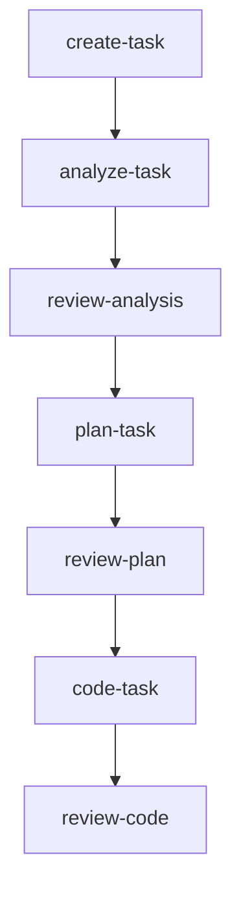
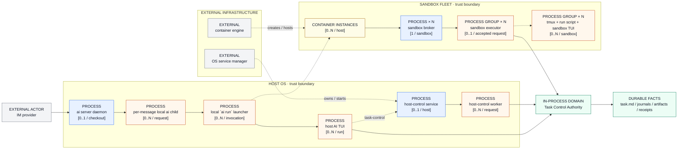
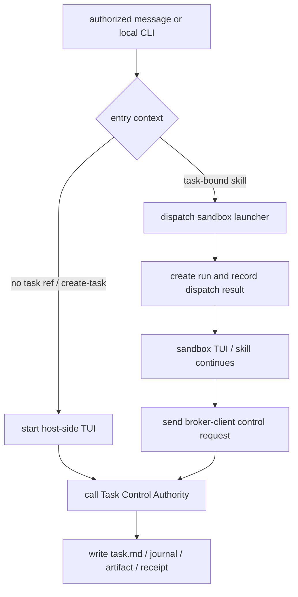

# Architecture Overview

[← Back to README](../../README.md) · [中文](../zh-CN/architecture.md)

agent-infra is intentionally simple: a bootstrap CLI creates the seed configuration, then AI skills and workflows take over.

## End-to-End Flow

1. **Install** — `npm install -g @fitlab-ai/agent-infra` (or `brew install fitlab-ai/tap/agent-infra` on macOS, or use the shell script wrapper)
2. **Initialize** — `ai init` in the project root to generate `.agents/.airc.json` and install the seed command
3. **Render** — run `update-agent-infra` in any AI TUI to detect the bundled template version and generate all managed files
4. **Develop** — use built-in skills to drive the full lifecycle. The user-facing skill sequence is shown below; names such as `analysis` and `design` in the internal workflow are stage labels, not skill entry points. Delivery after `review-code` is conditional and is described immediately below the graph.
5. **Update** — run `update-agent-infra` again whenever a new template version is available



After `review-code`, delivery is conditional rather than an unconditional `commit` step:

- If the review snapshot tree differs from its baseline, enter `commit`.
- If the tree is unchanged and there is no PR, `prFlow=disabled` enters `complete-task`; otherwise enter `create-pr`.
- If a PR exists but its head differs from the review baseline, enter `commit` for delivery.
- If the PR head matches and checks are pending, failed, cancelled, or the platform is unavailable, enter `watch-pr`.
- If the PR head matches and checks passed or no required checks exist, enter `complete-task`.

## Layered Architecture

```text
┌───────────────────────────────────────────────────────┐
│                     AI TUI Layer                      │
│  Claude Code · Codex · Antigravity · OpenCode         │
└──────────────────────────┬────────────────────────────┘
                           │ slash commands
                           ▼
┌───────────────────────────────────────────────────────┐
│                     Shared Layer                      │
│         Skills  ·  Workflows  ·  Templates            │
└──────────────────────────┬────────────────────────────┘
                           │ renders into
                           ▼
┌───────────────────────────────────────────────────────┐
│                    Project Layer                      │
│               .agents/  ·  AGENTS.md                  │
└───────────────────────────────────────────────────────┘
```

## Runtime and Control-Plane Map

The layered view above describes how the project is rendered. The first runtime view below is intentionally a highest-level topology: it answers what can exist, where it lives, and how many instances may exist. It does not describe operation order.

### Highest-level process topology



This view has one job: inventory runtime entities and their relationships. `PROCESS` means a separately observable OS process; `PROCESS GROUP` means a short-lived or per-run collection of processes; `IN-PROCESS DOMAIN` has no separate PID; `CONTAINER INSTANCES` is a boundary and count, not a process; `EXTERNAL` is owned outside this repository. `× N` means the node is replicated with the sandbox fleet. The arrows show launch, ownership, containment, or control relationships; they are not a chronological operation sequence.

The large frames have explicit meanings: `HOST OS` is the host-user process and permission boundary, `SANDBOX FLEET` is the set of `0..N` isolated container instances on that host, and `EXTERNAL INFRASTRUCTURE` contains services that own or host those entities. A frame is not an extra process and the number of frames is not the number of instances.

For environments that do not render Mermaid, the matrix and control-flow view below provide the same process, cardinality, authority, and lifecycle facts in text.

The detailed identities remain separate even though the highest-level view groups them:

- The daemon's per-message local `ai` child schedules a local CLI command. It is not the AI TUI that performs the selected skill.
- IM and local entry are separate: an authorized IM message goes through the daemon and its local child, while local `ai run` reaches the host TUI directly when there is no task reference or the sandbox launcher directly when a task reference is present.
- `create-task` is a host-side skill. `ai run` starts the selected TUI with stdin ignored and stdout/stderr inherited, then waits for that child to close.
- A task skill is task-bound. `ai run` creates a sandbox tmux `work` session and an `ai-<run-id>` window through `docker exec`, starts a run script and the actual TUI, then returns after the window is created. That return is dispatch success, not skill completion.
- Task-bound control requests originate from the sandbox TUI/skill through the internal CLI's broker-client route; they do not originate from the daemon's message-level local child.
- `run status`, `exit_code`, `finished_at`, and `output.log` describe the sandbox run. `task.md`, lifecycle journals, artifacts, and receipts describe task authority. Neither source replaces the other.
- Host-control, the sandbox broker/executor, the task lifecycle domain, the container engine, and the operating-system service manager have different identities and failure domains.

## Runtime Entity Matrix

| Entity | Start / stop | Communication | Permission and trust boundary | State and persistence | Failure and recovery |
| --- | --- | --- | --- | --- | --- |
| `ai server` daemon | `ai server start` launches at most one daemon per checkout; multiple checkouts can have separate instances; signals stop adapters and clean up | Local child processes, adapter contexts, heartbeat, and logs | Runs as the local OS user; an IM identity must pass adapter-qualified role checks first | Project/checkout-scoped PID identity, server log, and merged server configuration | Stale or mismatched PID records are not used to kill another process; adapter and command failures are isolated. |
| IM adapter / long connection (in-process) | Loaded and started by the daemon; stopped in reverse order | Provider WebSocket/API and normalized inbound/outbound messages | `<adapter>:<userId>` is an application identity, not an OS identity | Connection state is process-local; configuration comes from committed, local, and environment layers | Malformed messages are discarded; one adapter's credential or connection failure does not stop the daemon. |
| Per-message local `ai` child | Spawned for an authorized command and exits when that command ends | stdout/stderr → runner/streamer → adapter reply | Inherits the daemon's local OS context; does not itself grant task authority | Exit code, signal, and redacted stream events are message-level evidence | Spawn, non-zero exit, and reply failures are reported separately; unknown accepted work is not blindly replayed. |
| Host-side AI TUI child | `create-task` starts the selected Claude, Codex, Antigravity, OpenCode, or Trae CLI process and waits for close | stdin ignored; stdout/stderr inherited | Runs in the host user's context; a host create path is not a sandbox boundary | Process result plus task-create/lifecycle records | Startup and non-zero failures return to the caller; a TUI exit is not silently converted into task success. |
| Sandbox capture launcher (transient process) | A direct or daemon-scheduled task skill invokes `docker exec` per dispatch; the launcher lazily creates the `work` tmux session, an `ai-<run-id>` window, and the run script | Docker exec, container shell, and tmux launcher | Constrained by sandbox/container and task/generation identity; it does not replace broker authority | Run metadata, run directory, status files, and output log | Failure before window creation is dispatch failure; after creation, inspect status, exit code, and output. |
| Sandbox tmux server, pane/run script, and TUI (multiple processes) | The first dispatch lazily creates the `work` session (`0..1` per sandbox); the run script starts the actual TUI in its `ai-<run-id>` window, and the pane remains attachable after the command records its result | Container tmux pane, TUI stdio, and run script | Executes in the task-bound container and its runtime projection | `started_at`, `status`, `exit_code`, `finished_at`, and `output.log` | `completed`/`failed` is separate from task state; attach with `ai sandbox enter` to observe the run. |
| Host-control service and worker (service + transient process) | A systemd user service or macOS launchd service accepts requests and spawns controlled workers | Private endpoint/socket and worker stdio | Endpoint ownership, token, user permission, and worker identity | Endpoint/token files and audit records | Accepted work is not cancelled by client disconnect; dispatch failure is reported as unknown. |
| Task Control Authority / lifecycle domain (in-process; not a process) | Called by host workers, sandbox executors, or local CLI paths; not a separate long-lived service | Domain calls and control requests | Validates task, generation, operation, recovery, and artifact authority | `task.md`, active/blocked/completed directories, journals, short IDs, and receipts | Multi-step writes and directory moves require final-state verification. |
| Sandbox broker / executor | Recovery starts the broker; each authorized request gets a short-lived executor | Control channel and request/response/status records | Manifest, lease, controller binding, and attestation gates | Owner, lease, execution audit, and status records | Broker restart is distinct from request retry; accepted unknown side effects are not automatically replayed. |
| Codex controller / App Server | Lifecycle adapters start and stop them on demand | Controller binding; App Server line-delimited JSON-RPC over stdio | Provides Codex lifecycle evidence, not IM or task authority | Thread, turn, settings, reroute, and terminal evidence in the lifecycle store | Invalid child output, early exit, timeout, or binding mismatch invalidates evidence and closes the bridge. |
| Container engine and OS service manager (external infrastructure) | Docker/BuildKit/Colima/OrbStack/Docker Desktop and systemd/launchd own their external lifecycles | Docker API/CLI and OS service-manager APIs | Infrastructure boundary only; neither replaces task authority | Container, unit/plist, and engine runtime state | An available engine or service manager does not prove the complete task-bound chain is available. |
| Platform sync boundary (external boundary; not a process) | Invoked by lifecycle, worker, or CLI paths as needed | GitHub/platform APIs or provider adapters | Platform credentials remain separate from IM and local task authority | Issue/PR/label state and local receipts are separate facts | Remote failure must not be reported as local lifecycle success. |

## Control Paths

### Control-flow view (actions, not process inventory)

The topology above is the process inventory. This second view is deliberately an operation flow: its boxes are stages or facts, not additional processes.



The flow does not count processes. For process identity and multiplicity, use the topology and entity matrix above; for operation completion and recovery semantics, use the text below.

### IM and local `/run` admission

An IM adapter normalizes a provider event into the daemon's message contract. Built-in commands can be handled by the daemon. Other commands pass the adapter-qualified user allow-list and role check before the daemon spawns a local `ai` child. `/run` is then routed to `ai run --skill ...`; the local child is only the scheduler boundary.

A local `ai run` does not pass through the daemon: without a task reference it starts the host TUI directly, and with a task reference it starts the sandbox launcher directly. Internal task-control commands then choose the direct-host or broker-client transport from their runtime markers.

### Host-side `create-task`

```text
authorized message or local CLI
  → ai run --skill create-task <description>
  → select TUI and build its command
  → spawn host TUI with stdin ignored and stdout/stderr inherited
  → wait for TUI close and return the process result
  → task-create/lifecycle authority records the task result
```

This path has no task reference and no automatic sandbox requirement. A TUI startup error or non-zero exit must remain visible to the caller; it is not evidence that task creation completed.

### Task-bound sandbox skill

```text
authorized message or local CLI
  → ai run --skill <task-skill> --task <task-ref>
  → resolve the task sandbox and runtime identity
  → docker exec the sandbox launcher
  → create tmux session `work`, window `ai-<run-id>`, and run directory
  → write `running`, start the actual TUI, capture output and exit code
  → return after the tmux window is created
  → observe status/output or attach with `ai sandbox enter`
```

The run script records `started_at`, `status`, `exit_code`, and `finished_at`, and writes `output.log`. The command may report successful scheduling while the TUI is still running. A later `completed` or `failed` run status does not by itself change the task lifecycle state.

### Task lifecycle and authority

| Operation | Control path | Authoritative state | Recovery boundary |
| --- | --- | --- | --- |
| Create | CLI/daemon → direct-host or host-control worker → task-create domain | `task.md`, task directory, short ID, and create receipt | Admission failure can be returned before a task exists; partial writes require lifecycle recovery. |
| Task event / artifact | CLI or sandbox executor → broker/authority gate → task event/artifact domain | event log, artifact file, provenance and task state | Reject before acceptance; after acceptance, preserve the receipt and do not guess whether a side effect happened. |
| Restore | lifecycle request → staging/active validation → journal and directory move | task directory, journal, registry, and final task state | Reconcile the journal and final directory before retrying. |
| Block / cancel | authorized lifecycle operation → state transition and cleanup | task status, reason, journal, and released resources | Stop at the first unknown side effect; do not use a second command to mask it. |
| Complete | lifecycle and artifact gates → final status verification | task status, completed directory, receipts, and platform evidence | Missing review, artifact, or sync evidence keeps completion closed. |

Host-control authorizes and audits host workers; the task lifecycle domain owns task files and transitions. The sandbox broker authorizes task-bound execution; the TUI process produces run output but does not become the task authority.

## State, Failure, and Recovery Boundaries

- **Rejected** means admission or authorization failed before the requested operation was accepted. It can be retried only after the rejected input or authority issue is corrected.
- **Failed** means a known process or operation ended unsuccessfully. Use the relevant exit code, status record, log, or audit to locate the failure.
- **Unknown** means acceptance or a side effect cannot be determined. Do not automatically replay a task event, worker request, sandbox execution, or TUI command.
- **Host command returned** means the selected host TUI child exited and its process result was returned; it does not by itself mean task creation or the requested skill succeeded.
- **Sandbox dispatch complete** means the tmux `work` session and `ai-<run-id>` window were created; it does not mean the sandbox TUI, skill, or task completed.
- **Recovery** is scoped to the owning boundary: daemon PID/log cleanup, adapter reconnect, sandbox broker restart, executor reconciliation, run status/output inspection, lifecycle journal recovery, or platform sync retry. One boundary's recovery evidence cannot stand in for another's.
- The tmux pane may remain available for inspection after the run script records a terminal command status. Pane existence is therefore not a success signal.

## Platform Matrix

| Execution context | Available boundary | Important limitation |
| --- | --- | --- |
| macOS | launchd user service for host-control; local daemon and host TUI; container backends where configured | Container availability does not replace task authority or broker readiness. |
| Linux | systemd user service for host-control; local daemon and host TUI; configured container engine | The engine, broker, host-control, and task lifecycle remain separately observable services. |
| Native Windows | Some CLI/process and container paths may exist; Docker Desktop can provide container capability | There is no equivalent native host-control service for the complete host task-bound lifecycle; container support is not full lifecycle support. |
| WSL2 Linux | Linux-side Node, systemd/user-service, and container behavior depend on the WSL2 distribution and runtime configuration | WSL2 Linux behavior must not be presented as native Windows host-control support; validate the actual execution context before claiming a closed loop. |
| Docker/WSL2 backend | Container sandbox and its internal run/TUI path may be available | A working container backend does not prove host-control, task authority, platform sync, or every TUI is operational. |

## Scope and Source Pointers

This document describes the current repository behavior. Detailed provider protocol and sandbox control contracts remain in [Feishu Bridge](./feishu-bridge.md), [Sandbox](./sandbox.md), and [Platform Support](./platform-support.md); this overview keeps the relationships, authorities, and recovery boundaries in one place.

It does not add a Windows host-control implementation, a new TUI adapter, a compatibility shim, a migration, or a new runtime state machine. Cross-platform services, external TUI availability, and container health still require environment-specific validation.
