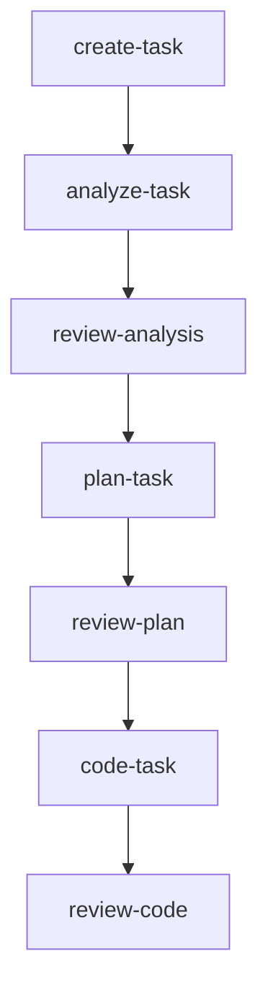
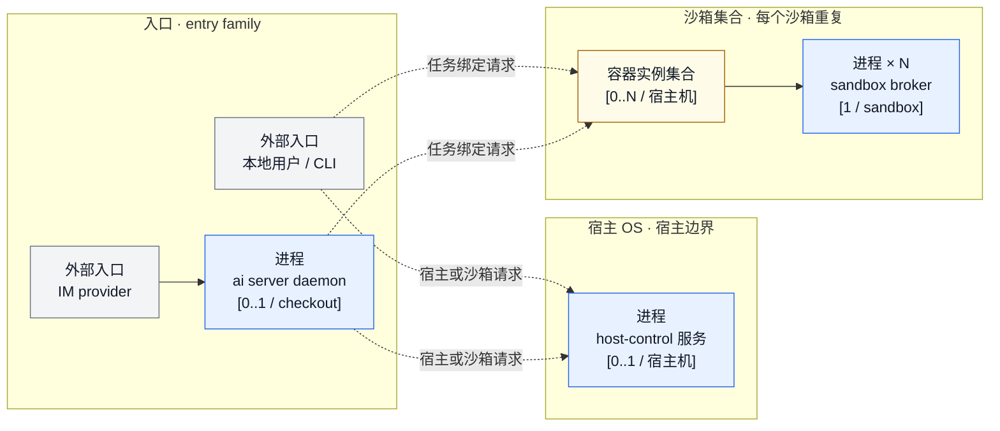
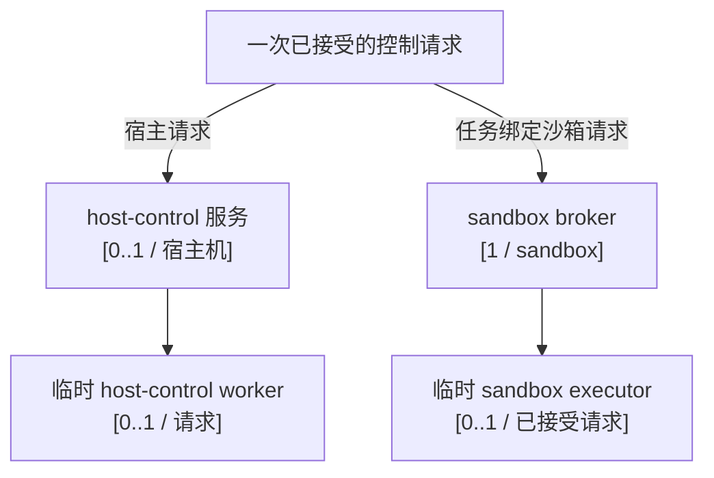
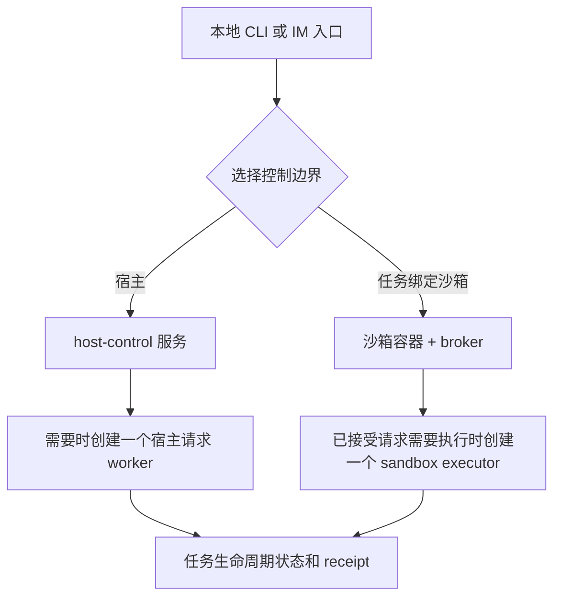

# 架构概览

[← 返回 README](../../README.zh-CN.md) · [English](../en/architecture.md)

agent-infra 的结构刻意保持简单：引导 CLI 负责生成种子配置，之后由 AI skills 和 workflows 接管后续协作。

## 端到端流程

1. **安装** — `npm install -g @fitlab-ai/agent-infra`（或在 macOS 上使用 `brew install fitlab-ai/tap/agent-infra`，或使用 shell 脚本便捷封装）
2. **初始化** — 在项目根目录运行 `ai init`，生成 `.agents/.airc.json` 并安装种子命令
3. **渲染** — 在任意 AI TUI 中执行 `update-agent-infra`，检测当前打包模板版本并生成受管理文件
4. **开发** — 使用下面的面向用户的 skill 顺序。内部 workflow 名称不是 skill 入口。
5. **升级** — 有新模板版本时再次执行 `update-agent-infra` 即可



`review-code` 之后的交付是条件路由：根据审查树、PR 状态和检查结果进入 `commit`、`create-pr`、`watch-pr` 或 `complete-task`。

## 分层架构

```text
┌───────────────────────────────────────────────────────┐
│                     AI TUI Layer                      │
│  Claude Code · Codex · Antigravity · OpenCode         │
└──────────────────────────┬────────────────────────────┘
                           │ slash 命令
                           ▼
┌───────────────────────────────────────────────────────┐
│                     Shared Layer                      │
│         Skills  ·  Workflows  ·  Templates            │
└──────────────────────────┬────────────────────────────┘
                           │ 渲染为
                           ▼
┌───────────────────────────────────────────────────────┐
│                    Project Layer                      │
│               .agents/  ·  AGENTS.md                  │
└───────────────────────────────────────────────────────┘
```

## 运行时与控制面总览

运行时视图刻意分层。第一层只回答：有哪些入口和核心常驻组件、它们位于哪里、可能有多少个实例。第二层只解释一次已接受请求会派生哪些短生命周期进程。

### 1. 最高层核心拓扑



这张图是主要架构图，只回答核心结构：

- `本地用户 / CLI` 和 `IM provider` 是两组入口。
- `ai server daemon` 是 IM 入口的可选进程：每个 checkout 最多一个。本地 CLI 不依赖它。
- `host-control 服务` 是宿主机级服务：`[0..1 / 宿主机]`。
- `容器实例集合` 表示每个沙箱一个 Docker 容器，宿主机上为 `[0..N]` 个。它是沙箱边界和数量，不是另一个项目进程。
- 每个沙箱有一个 `sandbox broker`：`[1 / sandbox]`。broker 是该沙箱长期存在的控制进程。
- 虚线表示入口可以选择的控制路径，不表示固定的父子进程链；短暂的调度实现有意隐藏在本图之外。

容器引擎和 OS 服务管理器负责外围基础设施，但不是每个沙箱一个进程，所以不计入核心进程数量。用户在沙箱内自行创建的程序也不属于这张架构图。

| 核心对象 | 数量 | 含义 |
| --- | --- | --- |
| 本地 CLI 入口 | `0..N / 调用` | 用户入口，可选择宿主路径或任务绑定沙箱路径。 |
| IM provider 入口 | `0..N / provider` | 外部消息来源。 |
| `ai server` daemon | `0..1 / checkout` | 接纳一个 checkout 的 IM 流量的可选进程。 |
| `host-control` 服务 | `0..1 / 宿主机` | 宿主侧控制服务和 direct-host authority。 |
| Docker 沙箱容器 | `0..N / 宿主机` | 每个沙箱一个隔离容器实例。 |
| `sandbox broker` | `1 / sandbox` | 每个沙箱容器内一个控制 broker。 |

### 2. 单次请求派生进程



`sandbox executor` 不是另一个沙箱，也不是另一个 broker。它是 broker 接受一次授权控制请求后才创建的短生命周期项目 worker，负责执行这一次请求，完成后退出。没有已接受的请求时，就没有 executor。host-control worker 与它类似，对应一次宿主侧请求。

这张下层图也不枚举用户在容器内启动的程序。那些内容可变、由用户拥有，不属于项目固定的进程拓扑。

### 入口与请求边界

- 本地 CLI 是直接入口组，不需要 IM daemon，即可选择宿主控制或任务绑定沙箱。
- IM 消息通过可选的 `ai server daemon` 接纳，再选择同样的宿主或沙箱控制边界。
- host-control 和 sandbox broker 是两个独立的控制边界：host-control 负责宿主授权和 worker；broker 负责沙箱授权以及一次已接受请求的 executor。
- 校验任务文件和状态转换的任务生命周期逻辑属于进程内领域逻辑，不是进程，也不计入最高层进程数量。

## 核心组件矩阵

| 组件 | 启动 / 停止 | 通信 | 边界与数量 | 持久事实 | 失败边界 |
| --- | --- | --- | --- | --- | --- |
| 本地 CLI 入口 | 用户调用时启动，随调用结束 | 本地参数和标准流 | 宿主用户入口；`0..N / 调用` | 命令结果和任务 receipt | 命令返回不证明远端或沙箱操作已完成。 |
| IM provider 入口 | 外部 provider 投递消息，连接由 provider 管理 | Provider API 或长连接 adapter | 外部身份；不是本仓库内的 OS 进程 | provider 消息和回复证据 | provider、凭据和连接失败不等于本地任务权威成功。 |
| `ai server` daemon | `ai server start` 每个 checkout 至多启动一个；收到信号后停止 | provider adapter 与已接纳请求调度 | 宿主用户进程；`0..1 / checkout` | checkout 级 PID identity 和 daemon log | stale identity 或 adapter 失败不能被解释为任务成功。 |
| `host-control` 服务 | OS 服务管理器在每台宿主机启动/停止一个服务 | 私有宿主 endpoint 与请求/响应记录 | 宿主用户边界；`0..1 / 宿主机` | endpoint、token、审计和 worker 记录 | authority 缺失时 fail closed；已接受但未知的结果不静默重放。 |
| Docker 沙箱容器 | 容器引擎为每个沙箱创建/停止一个容器 | 容器运行时和任务投影 | 沙箱边界；`0..N / 宿主机` | 容器 identity、generation 和沙箱控制记录 | 容器可用不等于 host-control 或任务生命周期已就绪。 |
| sandbox broker | 随沙箱控制状态启动，随沙箱停止 | 沙箱控制通道和请求记录 | 每个沙箱一个；`[1 / sandbox]` | manifest、lease、owner、generation 和执行审计 | identity、lease 或接纳失败在执行前拒绝。 |

## 控制与生命周期视图

以下视图描述请求和状态，不是新增进程；它们有意放在核心拓扑之下。



`task.md`、生命周期 journal、artifact、receipt 和平台记录是各自生命周期操作拥有的事实，不是进程，也不计入最高层拓扑。

| 操作 | 选择的边界 | 权威结果 | 恢复规则 |
| --- | --- | --- | --- |
| Create | host-control 路径 | `task.md`、任务目录、短号和 create receipt | 重试前对账部分写入。 |
| Task event / artifact | host-control 或 sandbox broker 路径 | event/artifact provenance 和任务状态 | 保留 receipt；接受后未知时不猜测。 |
| Restore | lifecycle request 边界 | 任务目录、journal、registry 和最终状态 | 重试前对账 journal 与最终目录。 |
| Block / cancel | 授权 lifecycle 边界 | 状态、原因、journal 和已释放资源 | 在第一个未知副作用处停止。 |
| Complete | lifecycle 与 artifact gate | completed 状态、receipt、review 和平台证据 | 缺少证据时保持未完成。 |

## 平台边界

| 执行上下文 | 核心能力 | 重要限制 |
| --- | --- | --- |
| macOS | `host-control` 可由用户级 launchd 服务管理；已配置的容器引擎可提供沙箱 | 容器能力不替代宿主服务或任务绑定生命周期。 |
| Linux | `host-control` 可由用户级 systemd 服务管理；已配置的容器引擎可提供沙箱 | engine、broker、host-control 和任务生命周期仍是独立边界。 |
| 原生 Windows | 部分 CLI/进程和 Docker Desktop 容器路径可能存在 | 没有等价的原生 host-control 服务来闭合完整宿主 task-bound 生命周期。 |
| WSL2 Linux | Linux 侧服务和容器行为取决于发行版及运行时配置 | WSL2 Linux 行为不能写成原生 Windows host-control 支持。 |

## 范围与事实源

本文描述仓库固定的控制面组件及其边界。本文有意不枚举沙箱内由用户创建的程序，也不列出每个短生命周期的调度实现细节。

provider、沙箱和平台契约的详细说明继续保留在[飞书桥接](./feishu-bridge.md)、[沙箱](./sandbox.md)和[平台支持](./platform-support.md)文档中；本文集中说明入口组、host-control 数量、沙箱数量、broker 数量和请求派生控制进程。

本文不新增 Windows host-control 实现、adapter、兼容 shim、迁移或运行状态机变化。
