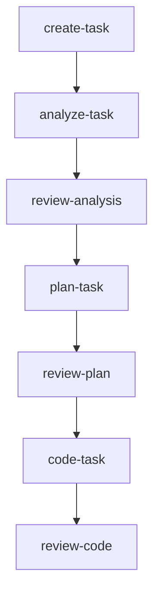
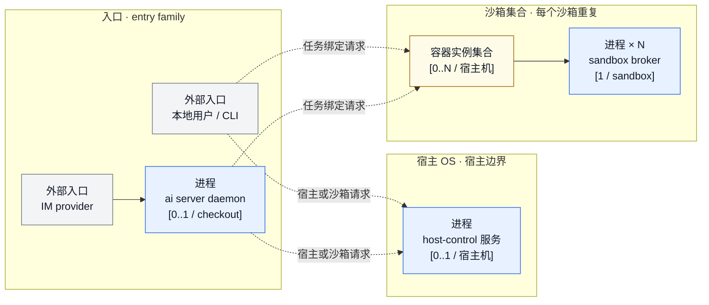
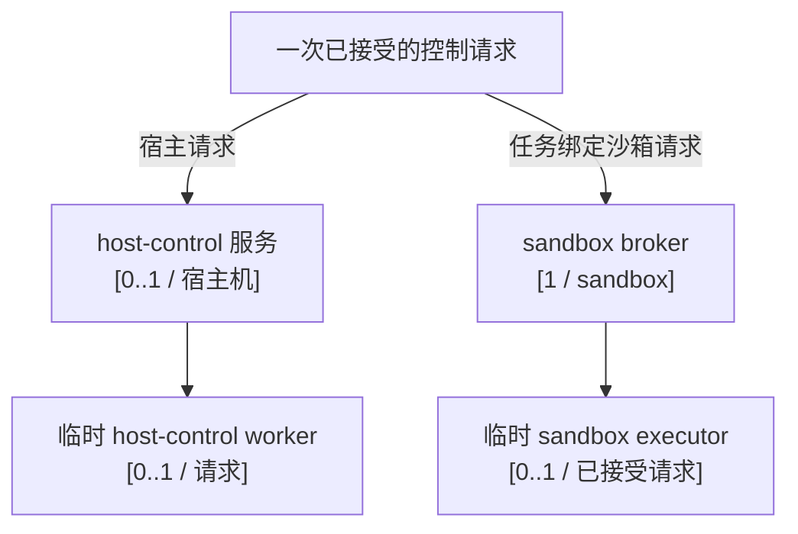
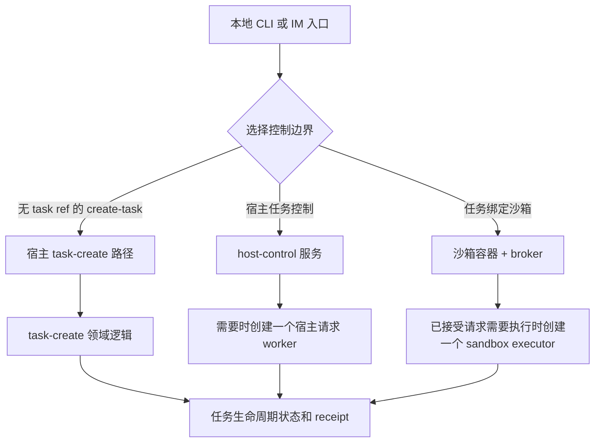

# 架构概览

[← 返回 README](../../README.zh-CN.md) · [English](../en/architecture.md)

agent-infra 的结构刻意保持简单：引导 CLI 负责生成种子配置，之后由 AI skills 和 workflows 接管后续协作。

## 端到端流程

1. **安装** — `npm install -g @fitlab-ai/agent-infra`（或在 macOS 上使用 `brew install fitlab-ai/tap/agent-infra`，或使用 shell 脚本便捷封装）
2. **初始化** — 在项目根目录运行 `ai init`，生成 `.agents/.airc.json` 并安装种子命令
3. **渲染** — 在任意 AI TUI 中执行 `update-agent-infra`，检测当前打包模板版本并生成受管理文件
4. **开发** — 使用下面的面向用户的 skill 顺序。内部 workflow 名称不是 skill 入口。
5. **升级** — 有新模板版本时再次执行 `update-agent-infra` 即可



`review-code` 之后的交付是条件路由：根据审查树、PR 状态和检查结果进入 `commit`、`create-pr`、`watch-pr` 或 `complete-task`。

## 分层架构

```text
┌───────────────────────────────────────────────────────┐
│                     AI TUI Layer                      │
│  Claude Code · Codex · Antigravity · OpenCode         │
└──────────────────────────┬────────────────────────────┘
                           │ slash 命令
                           ▼
┌───────────────────────────────────────────────────────┐
│                     Shared Layer                      │
│         Skills  ·  Workflows  ·  Templates            │
└──────────────────────────┬────────────────────────────┘
                           │ 渲染为
                           ▼
┌───────────────────────────────────────────────────────┐
│                    Project Layer                      │
│               .agents/  ·  AGENTS.md                  │
└───────────────────────────────────────────────────────┘
```

## 运行时与控制面总览

运行时视图刻意分层。第一层只回答：有哪些入口和核心常驻组件、它们位于哪里、可能有多少个实例。第二层只解释一次已接受请求会派生哪些短生命周期进程。

### 1. 最高层核心拓扑



这张图是主要架构图，只回答核心结构：

- `本地用户 / CLI` 和 `IM provider` 是两组入口。
- `ai server daemon` 是 IM 入口的可选进程：每个 checkout 最多一个。本地 CLI 不依赖它。
- `host-control 服务` 是宿主机级服务：`[0..1 / 宿主机]`。
- `容器实例集合` 表示每个沙箱一个 Docker 容器，宿主机上为 `[0..N]` 个。它是沙箱边界和数量，不是另一个项目进程。
- 每个沙箱有一个 `sandbox broker`：`[1 / sandbox]`。broker 是该沙箱长期存在的控制进程。
- 虚线表示入口可以选择的控制路径，不表示固定的父子进程链；短暂的调度实现有意隐藏在本图之外。

容器引擎和 OS 服务管理器负责外围基础设施，但不是每个沙箱一个进程，所以不计入核心进程数量。用户在沙箱内自行创建的程序也不属于这张架构图。

| 核心对象 | 数量 | 含义 |
| --- | --- | --- |
| 本地 CLI 入口 | `0..N / 调用` | 用户入口，可选择宿主路径或任务绑定沙箱路径。 |
| IM provider 入口 | `0..N / provider` | 外部消息来源。 |
| `ai server` daemon | `0..1 / checkout` | 接纳一个 checkout 的 IM 流量的可选进程。 |
| `host-control` 服务 | `0..1 / 宿主机` | 宿主侧控制服务和 direct-host authority。 |
| Docker 沙箱容器 | `0..N / 宿主机` | 每个沙箱一个隔离容器实例。 |
| `sandbox broker` | `1 / sandbox` | 每个沙箱容器内一个控制 broker。 |

### 2. 单次请求派生进程



`sandbox executor` 不是另一个沙箱，也不是另一个 broker。它是 broker 接受一次授权控制请求后才创建的短生命周期项目 worker，负责执行这一次请求，完成后退出。没有已接受的请求时，就没有 executor。host-control worker 与它类似，对应一次宿主侧请求。

这张下层图也不枚举用户在容器内启动的程序。那些内容可变、由用户拥有，不属于项目固定的进程拓扑。

### 入口与请求边界

- 本地 CLI 是直接入口组，不需要 IM daemon，即可选择宿主控制或任务绑定沙箱。
- IM 消息通过可选的 `ai server daemon` 接纳，再选择同样的宿主或沙箱控制边界。
- host-control 和 sandbox broker 是两个独立的控制边界：host-control 负责宿主授权和 worker；broker 负责沙箱授权以及一次已接受请求的 executor。
- 校验任务文件和状态转换的任务生命周期逻辑属于进程内领域逻辑，不是进程，也不计入最高层进程数量。

## 核心组件矩阵

| 组件 | 启动 / 停止 | 通信 | 边界与数量 | 持久事实 | 失败边界 |
| --- | --- | --- | --- | --- | --- |
| 本地 CLI 入口 | 用户调用时启动，随调用结束 | 本地参数和标准流 | 宿主用户入口；`0..N / 调用` | 命令结果和任务 receipt | 命令返回不证明远端或沙箱操作已完成。 |
| IM provider 入口 | 外部 provider 投递消息，连接由 provider 管理 | Provider API 或长连接 adapter | 外部身份；不是本仓库内的 OS 进程 | provider 消息和回复证据 | provider、凭据和连接失败不等于本地任务权威成功。 |
| `ai server` daemon | `ai server start` 每个 checkout 至多启动一个；收到信号后停止 | provider adapter 与已接纳请求调度 | 宿主用户进程；`0..1 / checkout` | checkout 级 PID identity 和 daemon log | stale identity 或 adapter 失败不能被解释为任务成功。 |
| `host-control` 服务 | OS 服务管理器在每台宿主机启动/停止一个服务 | 私有宿主 endpoint 与请求/响应记录 | 宿主用户边界；`0..1 / 宿主机` | endpoint、token、审计和 worker 记录 | authority 缺失时 fail closed；已接受但未知的结果不静默重放。直连宿主的 `create-task` 是独立的进程内路径。 |
| Docker 沙箱容器 | 容器引擎为每个沙箱创建/停止一个容器 | 容器运行时和任务投影 | 沙箱边界；`0..N / 宿主机` | 容器 identity、generation 和沙箱控制记录 | 容器可用不等于 host-control 或任务生命周期已就绪。 |
| sandbox broker | 随沙箱控制状态启动，随沙箱停止 | 沙箱控制通道和请求记录 | 每个沙箱一个；`[1 / sandbox]` | manifest、lease、owner、generation 和执行审计 | identity、lease 或接纳失败在执行前拒绝。 |

## 详细运行实体与证据矩阵

下面的矩阵覆盖项目为任务创建并管理的下层运行实体及其证据边界，但不会改变最高层进程数量。六列是有意拆开的：生命周期、通信、信任边界、持久事实和失败/恢复不能混为一谈。短生命周期子进程和生成的运行文件不是常驻服务；进程内逻辑和 skill 也不是进程。

| 实体 | 类型 / 生命周期 | 通信 | 信任边界 | 持久事实 | 失败 / 恢复 |
| --- | --- | --- | --- | --- | --- |
| IM adapter / 长连接 | `ai server` 内的进程内 adapter；每个已配置 provider 至多一个活动 adapter | Provider API 或长连接 adapter 到本地调度 | provider identity、凭据和 daemon 接纳 | provider 消息、连接状态和回复证据 | 连接或接纳失败不等于任务成功；按 provider/daemon 规则恢复。 |
| 按消息创建的本地 `ai` 子进程 | 临时宿主子进程；IM 调用本地 CLI 时为 `0..N / 消息` | 本地 argv、stdio 和 daemon 结果处理 | daemon allow-list 和宿主用户；不是常驻服务 | 子进程退出结果和命令结果 | spawn/退出失败属于消息调度；不能证明后续工作已完成。 |
| 宿主侧 AI TUI 调用 | 临时宿主子进程；`0..1 / 宿主侧 run` | 选择的 TUI argv 和宿主标准流 | 宿主用户与 TUI 策略；不是沙箱进程 | 退出码或信号和宿主命令结果 | TUI 失败会返回给调用方；TUI 成功退出仍不同于任务完成。 |
| `ai run` 请求启动器 | 临时调度调用；`0..1 / 调用` | 解析 skill/task 选项、选择 TUI，再调用宿主或沙箱 runner | task ref 和命令 allow-list；不新增 authority | 选择的路径、task ref、适用时的 run record 和调度结果 | 路由或 readiness 失败会在用户工作前停止；dispatch 成功只表示选定边界接纳了 run。 |
| 沙箱请求启动器 | 临时宿主侧调度；`0..1 / 任务绑定调用` | 容器引擎 `exec` 在匹配容器中执行 launcher shell | branch/task identity、容器 readiness 和任务绑定沙箱 | run ID、容器、run 目录、命令和宿主 run record | 容器缺失/readiness 失败或 `exec` 失败会在 run window 前停止；接纳 dispatch 不等于 TUI 完成。 |
| `tmux` work session / server | 项目管理的沙箱运行时；session 惰性创建，至多 `0..1 / sandbox` | 容器内的 `tmux` server/session 命令 | 匹配的沙箱容器和任务工作树；不同于用户任意 session | session 名称、健康状态和沙箱运行时状态 | 缺失或陈旧的 tmux 状态由沙箱 readiness/entry 恢复；它不是任务 authority。 |
| 每次运行的 tmux window / pane | 项目管理的运行时端点；`0..N / sandbox`，每次接纳的 run 一个 | launcher 创建 window、pipe pane 输出并发送运行命令 | run ID、task ref 和沙箱内命令 | run 目录下的 window、pane、session 文件 | window/pane 创建失败是 dispatch 失败；pane 存在不代表 TUI 或 skill 已完成。 |
| 生成的 `run.sh` | 每次 run 一个生成的 shell 脚本和一个执行中的 shell；不是常驻服务 | 执行选定 TUI 命令并写入运行状态文件 | 根据任务绑定请求和 shell-quoted argv 生成 | `started_at`、`finished_at`、`status`、`exit_code` 和 `output.log` | 根据命令退出码写入 `completed` 或 `failed`，随后保留 pane shell；文件缺失时检查 run 目录。 |
| 沙箱 AI TUI + skill 调用 | 临时 TUI 子进程；每次 run 选择一个客户端；skill 是进程内 workflow 逻辑，不是进程 | TUI 通过 pane 使用 stdio、internal CLI、任务投影和生命周期记录 | 沙箱 task identity、TUI 命令策略和 skill authority | TUI 退出码、skill receipt/artifact/status、任务 journal 和输出元数据 | TUI 退出、skill 完成和任务完成相互独立；输出或状态未知时对账任务 receipt。 |
| host-control worker | 临时宿主进程；`0..1 / 宿主请求` | 私有宿主 endpoint 与请求/响应记录 | host-control token、OS 用户和生命周期 authority | accepted/completed 审计和 worker 结果 | accepted-but-unknown 工作按 request identity 对账；不能静默重放。 |
| sandbox executor | 临时沙箱侧 worker；`0..1 / 已接受 broker 请求` | broker 请求通道和隔离 CLI worker | manifest、owner、lease、controller 和 task authority gate | request、executor、终端响应和执行审计 | 拒绝时不执行；dispatch/transport 不确定时保持 unknown，由 broker 恢复。 |
| Task Control Authority | 进程内领域逻辑，不是进程 | typed control request、任务文件、journal、receipt 和生命周期 API | task identity、authority caller、lease 和 controller 检查 | 任务状态、receipt、journal、artifact provenance 和完成证据 | identity 无效或 authority 缺失时 fail closed；不成为进程节点。 |
| Codex lifecycle controller / App Server | controller 逻辑；收集证据时创建短生命周期 `codex app-server --stdio` 子进程 | hook、换行分隔 JSON-RPC 和 rollout 元数据 | 新子进程 identity、parent、role、model、effort 和终态检查 | hook 记录、App Server 响应和 lifecycle evidence | 证据缺失/冲突时 fail closed；App Server 证据不替代任务完成。 |
| 容器引擎 / OS 服务管理器 | 外部基础设施；宿主级服务，不是每个沙箱一个进程 | launchd/systemd 服务控制和 Docker/WSL2 runtime | 宿主用户/服务边界和容器 identity | 服务 identity、容器 identity、generation 和 readiness 检查 | backend 可用不等于任务 authority，也不会增加第二个 broker。 |
| 平台同步边界 | 外部集成边界，不是进程 | 平台 API 和同步 receipt | 配置的 provider/repository identity | 同步 receipt 和平台响应 | 发布失败不同于本地任务状态；只按记录的 identity 重试。 |

本矩阵列出项目为任务绑定 run 自动创建并管理的实体，但仍排除用户在沙箱内任意启动的程序。具体来说，skill 是 workflow 逻辑而非独立进程；`tmux`、`run.sh`、选定 TUI 及其 status/output 文件则必须列出，因为它们由项目创建并用于观察一次 run。

## 控制与生命周期视图

以下视图描述请求和状态，不是新增进程；它们有意放在核心拓扑之下。



`task.md`、生命周期 journal、artifact、receipt 和平台记录是各自生命周期操作拥有的事实，不是进程，也不计入最高层拓扑。

| 操作 | 选择的边界 | 权威结果 | 恢复规则 |
| --- | --- | --- | --- |
| Create | 未选择 broker transport 时走宿主 task-create 领域逻辑；选择沙箱 transport 时走 broker-client 请求 | `task.md`、任务目录、短号和 create receipt | 重试前对账部分写入。直连宿主的 create 不要求已有 host-control 服务；broker-client create 要求沙箱控制边界。 |
| Task event / artifact | host-control 或 sandbox broker 路径 | event/artifact provenance 和任务状态 | 保留 receipt；接受后未知时不猜测。 |
| Restore | lifecycle request 边界 | 任务目录、journal、registry 和最终状态 | 重试前对账 journal 与最终目录。 |
| Block / cancel | 授权 lifecycle 边界 | 状态、原因、journal 和已释放资源 | 在第一个未知副作用处停止。 |
| Complete | lifecycle 与 artifact gate | completed 状态、receipt、review 和平台证据 | 缺少证据时保持未完成。 |

### 控制路径细节

- IM adapter 把消息交给可选 daemon 接纳，之后可能创建一个临时本地 `ai` 子进程。本地 CLI 调用可以直接进入 `ai run`，不经过 daemon。
- `ai run` 启动器对没有 task ref 的请求执行宿主侧 TUI 子进程；带 task ref 的请求选择匹配沙箱路径，检查 readiness，再通过容器引擎调用沙箱请求启动器。
- 沙箱请求启动器创建或复用项目管理的 `work` tmux session，为本次 run 创建一个 window/pane，写入 `run.sh`，再把脚本发送到 pane；选定的 TUI 随后在任务绑定工作树中执行请求的 skill。
- `create-task` 是一条独立的条件路径。只有存在沙箱标记时，`resolveSandboxControlTransport()` 才选择 broker-client；否则命令在宿主进程内直接调用 task-create 领域逻辑。直连宿主的 create 不等同于常驻 host-control 服务，也不是只能经过 host-control。

### 完成与恢复事实

- 宿主命令返回退出码，只能证明选定的宿主侧子进程结束。任务绑定的 `ai run` 在沙箱 window/pane dispatch 后返回，不等待 TUI 或 skill 结束。
- 生成的 `run.sh` 将 `status` 从 `pending` 推进到 `running`，再写入 `completed` 或 `failed`，同时写入 `exit_code`、时间戳和 `output.log`；这些是 run 观察事实，不是任务生命周期 authority。
- TUI 退出、skill receipt/artifact、任务生命周期终态和平台同步 receipt 是四类独立事实；任务完成仍需通过 lifecycle 和 artifact gate。
- `ai sandbox enter` 是观察/附着路径。看到 session、window、pane 或 output log，本身不能证明 skill 或任务已完成。
- Codex lifecycle evidence 有自己的 controller、App Server、hook 和终态检查；子进程 identity 缺失或冲突时不能视为成功。
- rejected、failed 和 accepted-but-unknown 有不同恢复规则。accepted-but-unknown 必须保留 receipt 和 request identity 供对账，不能静默重试。
- 平台同步是外部边界：同步 receipt 只证明发布动作，不替代本地任务状态。

## 平台边界

| 执行上下文 | 核心能力 | 重要限制 |
| --- | --- | --- |
| macOS | `host-control` 可由用户级 launchd 服务管理；已配置的容器引擎可提供沙箱 | 容器能力不替代宿主服务或任务绑定生命周期。 |
| Linux | `host-control` 可由用户级 systemd 服务管理；已配置的容器引擎可提供沙箱 | engine、broker、host-control 和任务生命周期仍是独立边界。 |
| 原生 Windows | 部分 CLI/进程和 Docker Desktop 容器路径可能存在 | 没有等价的原生 host-control 服务来闭合完整宿主 task-bound 生命周期。 |
| WSL2 Linux | Linux 侧服务和容器行为取决于发行版及运行时配置 | WSL2 Linux 行为不能写成原生 Windows host-control 支持。 |
| Docker / WSL2 backend | 已配置的 Docker 或 WSL2 backend 可以为沙箱集合提供容器执行能力 | backend 可用不会让每个沙箱增加第二个 broker，也不会建立 host-control authority。 |

## 范围与事实源

本文描述仓库固定的控制面组件、项目拥有的运行细节及其边界。短生命周期实现细节只在解释控制路径或证据路径时列出，不把它们算作核心常驻进程。本文有意不枚举沙箱内由用户创建的程序。

provider、沙箱和平台契约的详细说明继续保留在[飞书桥接](./feishu-bridge.md)、[沙箱](./sandbox.md)和[平台支持](./platform-support.md)文档中；本文集中说明入口组、host-control 数量、沙箱数量、broker 数量和请求派生控制进程。

本文不新增 Windows host-control 实现、adapter、兼容 shim、迁移或运行状态机变化。
