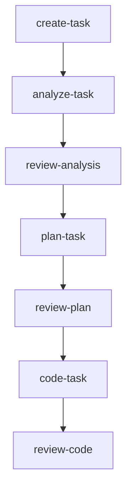
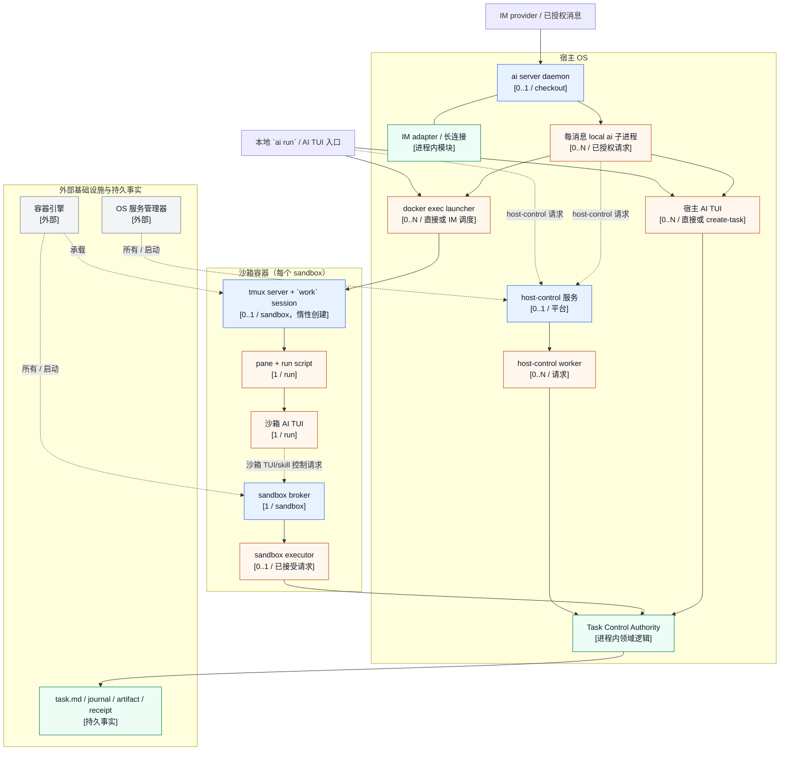

# 架构概览

[← 返回 README](../../README.zh-CN.md) · [English](../en/architecture.md)

agent-infra 的结构刻意保持简单：引导 CLI 负责生成种子配置，之后由 AI skills 和 workflows 接管后续协作。

## 端到端流程

1. **安装** — `npm install -g @fitlab-ai/agent-infra`（或在 macOS 上使用 `brew install fitlab-ai/tap/agent-infra`，或使用 shell 脚本便捷封装）
2. **初始化** — 在项目根目录运行 `ai init`，生成 `.agents/.airc.json` 并安装种子命令
3. **渲染** — 在任意 AI TUI 中执行 `update-agent-infra`，检测当前打包模板版本并生成所有受管理文件
4. **开发** — 使用内置 skill 驱动完整生命周期。下面展示面向用户的 skill 顺序；内部 workflow 中的 `analysis`、`design` 等名称是阶段标签，不是 skill 入口名。`review-code` 之后的交付是条件路由，图下正文会说明具体分支。
5. **升级** — 有新模板版本时再次执行 `update-agent-infra` 即可



`review-code` 之后不是无条件执行 `commit`，而是按交付状态路由：

- 审查快照树与基线不同，进入 `commit`。
- 树未变化且没有 PR 时，`prFlow=disabled` 进入 `complete-task`，否则进入 `create-pr`。
- 已有 PR 但其 head 与审查基线不同，进入 `commit` 执行交付。
- PR head 一致但检查仍为 pending、failed、cancelled，或平台不可用，进入 `watch-pr`。
- PR head 一致且检查通过或没有 required checks，进入 `complete-task`。

## 分层架构

```text
┌───────────────────────────────────────────────────────┐
│                     AI TUI Layer                      │
│  Claude Code · Codex · Antigravity · OpenCode         │
└──────────────────────────┬────────────────────────────┘
                           │ slash 命令
                           ▼
┌───────────────────────────────────────────────────────┐
│                     Shared Layer                      │
│         Skills  ·  Workflows  ·  Templates            │
└──────────────────────────┬────────────────────────────┘
                           │ 渲染为
                           ▼
┌───────────────────────────────────────────────────────┐
│                    Project Layer                      │
│               .agents/  ·  AGENTS.md                  │
└───────────────────────────────────────────────────────┘
```

## 运行时与控制面总览

上面的分层视图说明项目如何被渲染；下面的运行时进程拓扑图说明命令如何到达任务控制权威，以及实际 AI TUI 在哪里运行。



图中实线表示进程启动或控制，虚线表示所有关系或跨边界控制，并明确标出进程内领域逻辑。运行时没有固定的进程总数：一台宿主可以有 `0..N` 个按 checkout 隔离的 daemon，每个 checkout 至多一个；在已安装且运行时至多一个 host-control 服务；每个已授权 IM 请求可能增加一个 local `ai` 子进程，而直接或 IM 发起的 `ai run` 可能增加一个宿主 TUI 或沙箱 launcher/worker；每个沙箱有一个 broker，并可能在首次调度时惰性创建 `0..1` 个 tmux `work` session，每个活动运行再增加一个 pane/run script 与一个沙箱 TUI。仓库边界之外、由外部 TUI 或基础设施创建的 helper 进程不计入此图。

在不渲染 Mermaid 的环境中，下面的运行实体矩阵和控制路径章节提供相同的进程、基数、权威边界和生命周期事实。

这里的边界必须分开理解：

- daemon 的每消息 `ai` 子进程负责调度本地 CLI，不是执行所选 skill 的 AI TUI。
- IM 入口和本地入口是两条路径：已授权 IM 消息经 daemon 和 local child；本地 `ai run` 在没有 task ref 时直接进入宿主 TUI，在有 task ref 时直接进入沙箱 launcher。
- `create-task` 是宿主路径。`ai run` 启动选定 TUI，忽略 stdin、继承 stdout/stderr，并等待该子进程退出。
- task skill 绑定任务。`ai run` 通过 `docker exec` 创建沙箱 tmux `work` session 及 `ai-<run-id>` window，启动 run script 和实际 TUI；窗口创建后命令即可返回，这只表示调度成功，不表示 skill 完成。
- task-bound 控制请求由沙箱 TUI/skill 通过 internal CLI 的 broker-client 路径发起，不是由 daemon 的消息级 local child 发起。
- `run status`、`exit_code`、`finished_at` 和 `output.log` 描述一次沙箱运行；`task.md`、生命周期 journal、artifact 和 receipt 描述任务控制权威。两类事实不能互相替代。
- host-control、沙箱 broker/executor、任务生命周期领域、容器引擎和操作系统服务管理器拥有不同身份和失败域。

## 运行实体矩阵

| 实体 | 启动 / 停止 | 通信通道 | 权限与信任边界 | 状态与持久化 | 失败与恢复 |
| --- | --- | --- | --- | --- | --- |
| `ai server` daemon | `ai server start` 每个 checkout 至多启动一个 daemon；多个 checkout 可各自拥有实例；收到信号后停止 adapter 并清理 | 本地子进程、adapter context、heartbeat 和日志 | 以本机 OS 用户运行；IM 身份必须先通过 adapter-qualified role 检查 | 按项目/checkout 隔离的 PID identity、server log 和合并后的 server 配置 | stale 或不匹配的 PID 不用于错杀其他进程；adapter 与命令失败相互隔离。 |
| IM adapter / 长连接（进程内模块） | daemon 加载并启动；退出时逆序停止 | provider WebSocket/API 与规范化消息 | `<adapter>:<userId>` 是应用身份，不是 OS 身份 | 连接状态在进程内；配置来自 committed、local 和环境层 | malformed 消息丢弃；单个 adapter 的凭据或连接失败不停止 daemon。 |
| 每消息 local `ai` 子进程 | daemon 为已授权命令启动，命令结束后退出 | stdout/stderr → runner/streamer → adapter 回复 | 继承 daemon 的本机 OS 上下文；自身不授予任务权威 | 退出码、signal 和脱敏流事件属于消息级证据 | 启动、非零退出和回复失败分别报告；已接受但未知的工作不盲目重放。 |
| 宿主 AI TUI 子进程 | `create-task` 启动选定的 Claude、Codex、Antigravity、OpenCode 或 Trae CLI，TUI 关闭后回收 | stdin 忽略；stdout/stderr 继承 | 运行在宿主用户上下文；宿主 create 路径不是沙箱边界 | 进程结果以及 task-create/lifecycle 记录 | 启动和非零失败返回调用方；不能把 TUI 退出静默转换成任务成功。 |
| 沙箱 capture launcher（临时进程） | 直接或 daemon 调度的 task skill 每次 dispatch 调用 `docker exec`；launcher 惰性创建 `work` tmux session、`ai-<run-id>` window 和 run script | Docker exec、容器 shell 和 tmux launcher | 受 sandbox/container 与 task/generation identity 约束；不替代 broker authority | run metadata、run directory、状态文件和输出日志 | 窗口创建前失败属于调度失败；创建后检查 status、exit code 和 output。 |
| 沙箱 tmux server、pane/run script 与 TUI（多个进程） | 首次 dispatch 惰性创建 `work` session（每个 sandbox 为 `0..1`）；run script 在其中的 `ai-<run-id>` window 启动实际 TUI，命令记录结果后 pane 仍可附着 | 容器 tmux pane、TUI stdio 和 run script | 在 task-bound 容器及其 runtime projection 中执行 | `started_at`、`status`、`exit_code`、`finished_at` 和 `output.log` | `completed`/`failed` 与任务状态分离；用 `ai sandbox enter` 观察运行。 |
| host-control 服务与 worker（服务 + 临时进程） | systemd user service 或 macOS launchd 托管服务并启动受控 worker | 私有 endpoint/socket 与 worker stdio | endpoint 所有权、token、用户权限和 worker identity | endpoint/token 文件与审计记录 | 客户端断连不取消已接受工作；dispatch 失败报告为 unknown。 |
| Task Control Authority / 生命周期领域（进程内，不是进程） | 由 host worker、sandbox executor 或本地 CLI 路径调用，不是独立常驻服务 | 领域调用与控制请求 | 校验 task、generation、operation、recovery 和 artifact authority | `task.md`、active/blocked/completed 目录、journal、短号和 receipt | 多步写入与目录移动后必须核验最终状态。 |
| 沙箱 broker / executor | recovery 启动 broker；每个授权请求使用短生命周期 executor | control channel 与 request/response/status records | manifest、lease、controller binding 和 attestation gate | owner、lease、execution audit 和状态记录 | broker 重启不等于请求重试；已接受但未知的副作用不自动重放。 |
| Codex controller / App Server | lifecycle adapter 按需启动和停止 | controller binding；App Server 通过 stdio 使用行分隔 JSON-RPC | 只提供 Codex lifecycle evidence，不替代 IM 或 task authority | lifecycle store 中的 thread、turn、settings、reroute 和 terminal 证据 | 子进程输出非法、提前退出、超时或 binding 不一致会使证据失效并关闭 bridge。 |
| 容器引擎与 OS 服务管理器（外部基础设施） | Docker/BuildKit/Colima/OrbStack/Docker Desktop 以及 systemd/launchd 管理外部生命周期 | Docker API/CLI 和 OS service-manager API | 只是基础设施边界，不替代任务权威 | 容器、unit/plist 和 engine runtime 状态 | 引擎或服务管理器可用，不等于完整 task-bound 链可用。 |
| 平台同步边界（外部边界，不是进程） | lifecycle、worker 或 CLI 按需调用 | GitHub/platform API 或 provider adapter | 平台凭据与 IM、本地任务权威分离 | Issue/PR/label 状态与本地 receipt 分属不同事实 | 远端失败不能报告成本地生命周期成功。 |

## 控制路径

### IM 与本地 `/run` 接纳

IM adapter 将 provider 事件规范化为 daemon 消息契约。内置命令可由 daemon 直接处理；其他命令先通过 adapter-qualified user allow-list 和 role 检查，然后 daemon 才启动本地 `ai` 子进程。`/run` 随后路由为 `ai run --skill ...`；本地子进程只是调度边界。

本地 `ai run` 不经过 daemon：没有 task ref 时直接启动宿主 TUI，有 task ref 时直接启动沙箱 launcher。内部 task-control 命令再根据运行时标记选择 direct-host 或 broker-client transport。

### 宿主侧 `create-task`

```text
已授权消息或本地 CLI
  → ai run --skill create-task <description>
  → 选择 TUI 并构造命令
  → 忽略 stdin、继承 stdout/stderr，启动宿主 TUI
  → 等待 TUI 退出并返回进程结果
  → task-create/lifecycle authority 记录任务结果
```

这条路径没有 task ref，也没有自动沙箱要求。TUI 启动错误或非零退出必须返回调用方；它不能作为任务创建完成的证据。

### 任务绑定的沙箱 skill

```text
已授权消息或本地 CLI
  → ai run --skill <task-skill> --task <task-ref>
  → 解析任务沙箱和运行时身份
  → docker exec 沙箱 launcher
  → 创建 tmux session `work`、window `ai-<run-id>` 和 run directory
  → 写入 `running`，启动实际 TUI，捕获输出与退出码
  → tmux 窗口创建后返回
  → 通过 status/output 观察，或用 `ai sandbox enter` 附着
```

run script 写入 `started_at`、`status`、`exit_code` 和 `finished_at`，并写入 `output.log`。命令可能在 TUI 仍运行时报告调度成功；之后的 `completed` 或 `failed` run 状态也不会自动改变任务生命周期状态。

### 任务生命周期与权威边界

| 操作 | 控制路径 | 权威状态 | 恢复边界 |
| --- | --- | --- | --- |
| Create | CLI/daemon → direct-host 或 host-control worker → task-create domain | `task.md`、任务目录、短号和 create receipt | 接纳失败可在任务创建前返回；部分写入由 lifecycle recovery 处理。 |
| Task event / artifact | CLI 或 sandbox executor → broker/authority gate → task event/artifact domain | event log、artifact、provenance 和任务状态 | 接受前拒绝；接受后保留 receipt，不猜测副作用是否发生。 |
| Restore | lifecycle request → staging/active 校验 → journal 与目录移动 | 任务目录、journal、registry 和最终任务状态 | 重试前先对账 journal 和最终目录。 |
| Block / cancel | 授权 lifecycle 操作 → 状态转换与清理 | 任务状态、原因、journal 和已释放资源 | 在第一个未知副作用处停止，不用第二条命令掩盖未知状态。 |
| Complete | lifecycle 与 artifact gate → 最终状态核验 | 任务状态、completed 目录、receipt 和平台证据 | 缺少 review、artifact 或同步证据时保持未完成。 |

host-control 负责授权和审计宿主 worker；任务生命周期领域负责任务文件和状态转换。沙箱 broker 负责 task-bound 执行授权；TUI 进程产生运行输出，但不成为任务权威。

## 状态、失败与恢复边界

- **Rejected** 表示接纳或授权在操作接受前失败。只有修正输入或 authority 问题后才能重试。
- **Failed** 表示已知进程或操作以失败结束。使用对应的退出码、状态记录、日志或审计定位失败。
- **Unknown** 表示无法确定是否已接受或是否产生副作用。不要自动重放 task event、worker 请求、sandbox execution 或 TUI 命令。
- **Host command returned** 表示选定的宿主 TUI 子进程退出并返回进程结果；它本身不表示任务创建或所选 skill 成功。
- **Sandbox dispatch complete** 表示 tmux `work` session 和 `ai-<run-id>` window 已创建；它不表示沙箱 TUI、skill 或任务完成。
- **Recovery** 由所属边界负责：daemon PID/log 清理、adapter 重连、sandbox broker 重启、executor 对账、run status/output 检查、lifecycle journal 恢复或平台同步重试。一个边界的证据不能替代另一个边界。
- run script 写入终态后，tmux pane 仍可能保留以便观察；pane 存在不是运行成功信号。

## 平台矩阵

| 执行上下文 | 可用边界 | 重要限制 |
| --- | --- | --- |
| macOS | host-control 使用 launchd user service；可运行本地 daemon、宿主 TUI，以及已配置的容器后端 | 容器可用不替代任务权威或 broker readiness。 |
| Linux | host-control 使用 systemd user service；可运行本地 daemon、宿主 TUI 和已配置的容器引擎 | engine、broker、host-control 和任务生命周期仍是分别观察的服务。 |
| 原生 Windows | 部分 CLI/进程和容器路径可能存在；Docker Desktop 可提供容器能力 | 没有等价的原生 host-control 服务来闭合宿主 task-bound 生命周期；容器支持不是完整生命周期支持。 |
| WSL2 Linux | Linux 侧 Node、systemd/user-service 和容器行为取决于 WSL2 发行版及运行时配置 | WSL2 Linux 行为不能写成原生 Windows host-control 支持；宣称闭环前必须验证实际执行上下文。 |
| Docker/WSL2 后端 | 可能提供容器沙箱及其内部 run/TUI 路径 | 容器后端可用不证明 host-control、任务权威、平台同步或每个 TUI 都可运行。 |

## 范围与事实源

本文描述当前仓库行为。provider 协议和沙箱控制契约的细节继续保留在[飞书桥接](./feishu-bridge.md)、[沙箱](./sandbox.md)和[平台支持](./platform-support.md)文档中；本文集中说明它们之间的关系、权威和恢复边界。

本文不新增 Windows host-control 实现、TUI adapter、兼容 shim、迁移或新的运行状态机。跨平台服务、外部 TUI 可用性和容器健康仍需结合具体环境验证。
